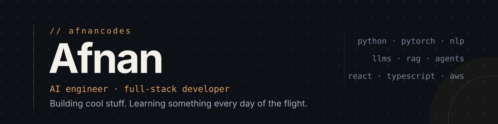

<!-- ── Banner ──────────────────────────────────────────────────────────────── -->

  &nbsp;
  &nbsp;
  &nbsp;
  &nbsp;
  <!-- Add when ready:
  
  -->

I design things that scale and build AI that ships. I run **5cale**, a design studio, and I trained myself as an AI engineer the hard way — a 23-project curriculum I built and shipped end-to-end, from hand-written backprop to CI/CD-gated ML pipelines. Every claim below has a repo behind it.

## ⚡ Now

- 🎨 Rebuilding the **5cale** site — Next.js 15, Three.js, GSAP, and a chrome "5" that follows your scroll
- 🤖 Shipped a **23-project AI-engineering roadmap** — foundations → deep learning → LLM systems → MLOps
- 🧪 Going deeper on **evals & agent reliability** — the unglamorous parts that make AI products trustworthy

## ⭐ Featured builds

<table>
<tr>
<td width="50%" valign="top">

**[TestGenRag](https://github.com/smafnan/TestGenRag)** 🧬 
Guardrailed, human-in-the-loop RAG agent that drafts citation-backed test cases from your documents. HyDE retrieval, relevance gate, LLM-as-judge grounding check. Live on HF Spaces. 
`LangGraph` · `FAISS` · `FastAPI` · `Docker` · `CI`

</td>
<td width="50%" valign="top">

**[ClaudeCodeStudent](https://github.com/smafnan/ClaudeCodeStudent)** 🔌 
Anthropic-Messages-API-compatible proxy with **17 provider backends** (NVIDIA NIM, OpenRouter, Gemini, Ollama…) — routes Claude Code's model tiers to any LLM, with streaming & tool-use translation. 
`FastAPI` · `SSE` · `Discord/Telegram bots` · `Admin UI`

</td>
</tr>
<tr>
<td width="50%" valign="top">

**[tiny-gpt](https://github.com/smafnan/tiny-gpt)** 🧠 
A character-level GPT built from scratch in PyTorch — multi-head causal self-attention written by hand, no `nn.MultiheadAttention`. 0.8M params trained on CPU, plus a web playground. 
`PyTorch` · `Transformers` · `React playground`

</td>
<td width="50%" valign="top">

**[mlops-pipeline](https://github.com/smafnan/mlops-pipeline)** 🏭 
Push-triggered ML pipeline: validate → train → **quality gate** → versioned registry → deploy, with PSI drift monitoring. A model below threshold literally cannot reach production — CI fails. 
`GitHub Actions` · `Model registry` · `Drift detection`

</td>
</tr>
<tr>
<td width="50%" valign="top">

**[reddit-answer-bot](https://github.com/smafnan/reddit-answer-bot)** 🗣️ 
7-agent LangGraph pipeline that answers questions by synthesizing Reddit community consensus — SSE streaming, live force-directed knowledge graph, and a Windows 98 theme (of course). 
`LangGraph` · `Multi-agent` · `FastAPI` · `React`

</td>
<td width="50%" valign="top">

**[eval-harness](https://github.com/smafnan/eval-harness)** 📏 
Evaluation framework for non-deterministic LLM systems — labelled cases, pluggable scorers incl. LLM-as-judge, and regression detection that exits non-zero so CI can block bad prompt changes. 
`LLM-as-judge` · `Regression gating` · `Python`

</td>
</tr>
</table>

## 🧭 The AI-Engineer Roadmap — 0 → production in 23 repos

> A self-built curriculum. Rule: no project counts until it's shipped, measured, and written up honestly.

`NumPy backprop` → `CNNs & transfer learning` → `GPT from scratch` → `RAG + agents + evals` → `Docker, CI/CD & drift monitoring` → `capstones`

<b>Expand the full journey</b>

 

| Phase | Projects |
|---|---|
| **0 · Tooling** | [data-cleaning-cli](https://github.com/smafnan/data-cleaning-cli) · [eda-penguins](https://github.com/smafnan/eda-penguins) — defensive CSV cleaner; EDA that surfaces Simpson's paradox |
| **1 · Classical ML** | [housing-regression](https://github.com/smafnan/housing-regression) · [fraud-classification](https://github.com/smafnan/fraud-classification) · [from-scratch-numpy](https://github.com/smafnan/from-scratch-numpy) — full ML loops, cost-based thresholds, algorithms rebuilt in NumPy |
| **2 · Deep learning** | [neural-net-from-scratch](https://github.com/smafnan/neural-net-from-scratch) (97.7% MNIST, hand-written backprop) · [cifar-pytorch](https://github.com/smafnan/cifar-pytorch) · [training-dashboard](https://github.com/smafnan/training-dashboard) |
| **3 · NLP & LLMs** | [text-classifier](https://github.com/smafnan/text-classifier) (TF-IDF vs DistilBERT) · [tiny-gpt](https://github.com/smafnan/tiny-gpt) · [llm-extractor](https://github.com/smafnan/llm-extractor) (validated JSON from any provider) |
| **4 · AI systems** | [rag-system](https://github.com/smafnan/rag-system) (retrieval measured with Recall@k/MRR) · [agent](https://github.com/smafnan/agent) (fails gracefully, on purpose) · [eval-harness](https://github.com/smafnan/eval-harness) |
| **5 · Production** | [model-service](https://github.com/smafnan/model-service) (Dockerized FastAPI) · [mlops-pipeline](https://github.com/smafnan/mlops-pipeline) · [llm-optimization](https://github.com/smafnan/llm-optimization) (−76% cost, −74% latency, measured) |
| **6 · Capstones** | [resume-tailor](https://github.com/smafnan/resume-tailor) (anti-fabrication guardrail) · [teaching-eval-harnesses](https://github.com/smafnan/teaching-eval-harnesses) (teach-it-back) |
| **★ Bonus** | [quran-rag](https://github.com/smafnan/quran-rag) & [nahjulbalagha-rag](https://github.com/smafnan/nahjulbalagha-rag) (grounded, citation-only answers) · [paper-rag](https://github.com/smafnan/paper-rag) · [business-website-finder](https://github.com/smafnan/business-website-finder) |

## 🧰 Stack

<picture>
  <source media="(prefers-color-scheme: dark)" srcset="https://skillicons.dev/icons?i=py,pytorch,sklearn,fastapi,docker,githubactions,git,ts,react,nextjs,tailwind,threejs,nodejs,figma,netlify,vite&perline=8&theme=dark">
  
</picture>

## 📊 GitHub

<picture>
  <source media="(prefers-color-scheme: dark)" srcset="https://github-readme-stats.vercel.app/api?username=smafnan&show_icons=true&hide_border=true&bg_color=00000000&title_color=7C3AED&icon_color=22D3EE&text_color=94A3B8&ring_color=7C3AED&rank_icon=github&include_all_commits=true">
  
</picture>&nbsp;&nbsp;
<picture>
  <source media="(prefers-color-scheme: dark)" srcset="https://streak-stats.demolab.com?user=smafnan&hide_border=true&background=00000000&ring=7C3AED&fire=22D3EE&currStreakLabel=7C3AED&sideLabels=94A3B8&currStreakNum=C7CEDB&sideNums=C7CEDB&dates=8B94A8">
  
</picture>

  

<!-- ── Contribution snake (generated by .github/workflows/snake.yml) ────────── -->
<picture>
  <source media="(prefers-color-scheme: dark)" srcset="https://raw.githubusercontent.com/smafnan/smafnan/output/github-contribution-grid-snake-dark.svg">
  
</picture>

 

  <b>5cale</b> · design that scales — systems that ship · <a href="https://afnancodes.com">afnancodes.com</a>

<!-- profile: smafnan -->
